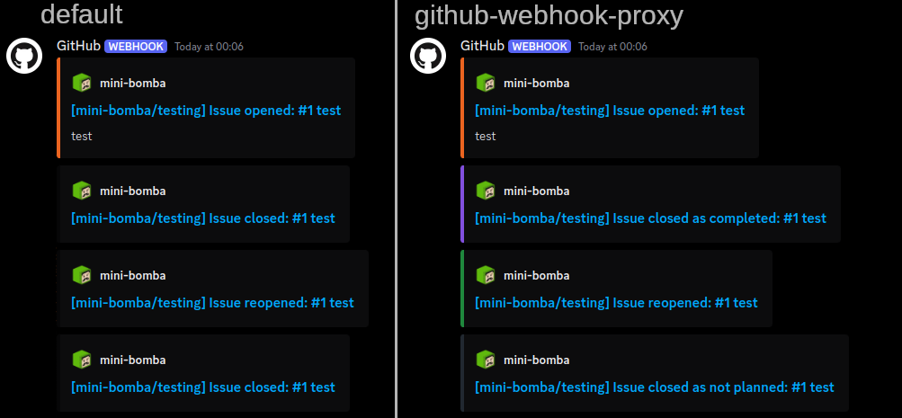
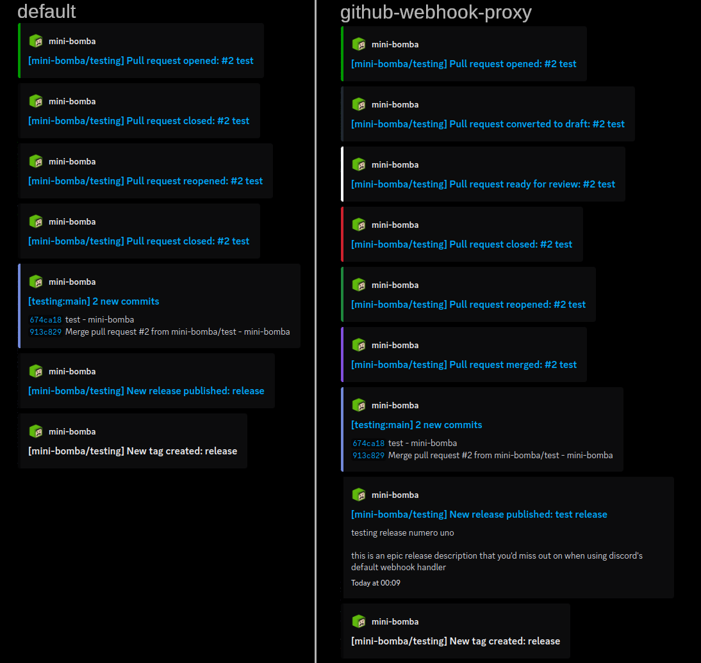

# [github-webhook-proxy](https://github.com/mini-bomba/github-webhook-proxy) but better and possibly with a better name

basically the project linked above, but slightly rewritten to run with deno.

public instance available at https://gh-webhook.minibomba.pro/

## routes

mostly the same

```
POST /{channel ID}/{webhook token} - Execute webhook
(also POST /api/webhooks/{channel ID}/{webhook token}/github for maxium compatibility with discord)

/ - Redirects to this repository
/version - Sends currently deployed git hash
/source - Redirects to a view of the currently deployed commit
```

## how 2 use
grab a discord webhook, replace `discord.com` with `gh-webhook.minibomba.pro`, give it to github, don

## the whys
### why rewrite?
i've recently have been encountering issues with cloudflare workers IPs getting blocked by discord, causing dropped messsages.
so i decided to slightly restructure the project to allow it to be run with deno, which has the closest http server api to cf workers.

### why intercept the webhook?
discord's github webhook support isn't great. 
it doesn't attach release descriptions to messages about them being created, it can't differentiate between a PR getting closed and it getting merged, it doesn't know about the different issue close reasons.
it really feels like no discord dev had touched that area in years - it feels outdated and unfinished.

## the features
this project can currently intercept and improve the following events:
- release creation
  - adds the release description and timestamp into the message
- issue closing/reopening
  - includes the reason for closing the issue (completed/not planned)
  - adds colors associated with the different close reasons and reopening the issue
- pull requests
  - differentiates between closing and merging the PR
  - sends messages when a PR is marked as draft or ready for review
  - adds colors associated with these actions
  - blocks "Pull request review submitted" events when someone comments on a review
    - review comment content will still be sent to discord if pull_request_review_comment event is enabled. this simply removes the noise

## some images i guess
### issue events

### PR and release events


## license
this project is licensed under MIT.
note that major parts of this project are simply copied from [github-webhook-proxy](https://github.com/mini-bomba/github-webhook-proxy)
(which is also my project) - this is why the license file has a date of 2022 despite the git history starting in 2025.
